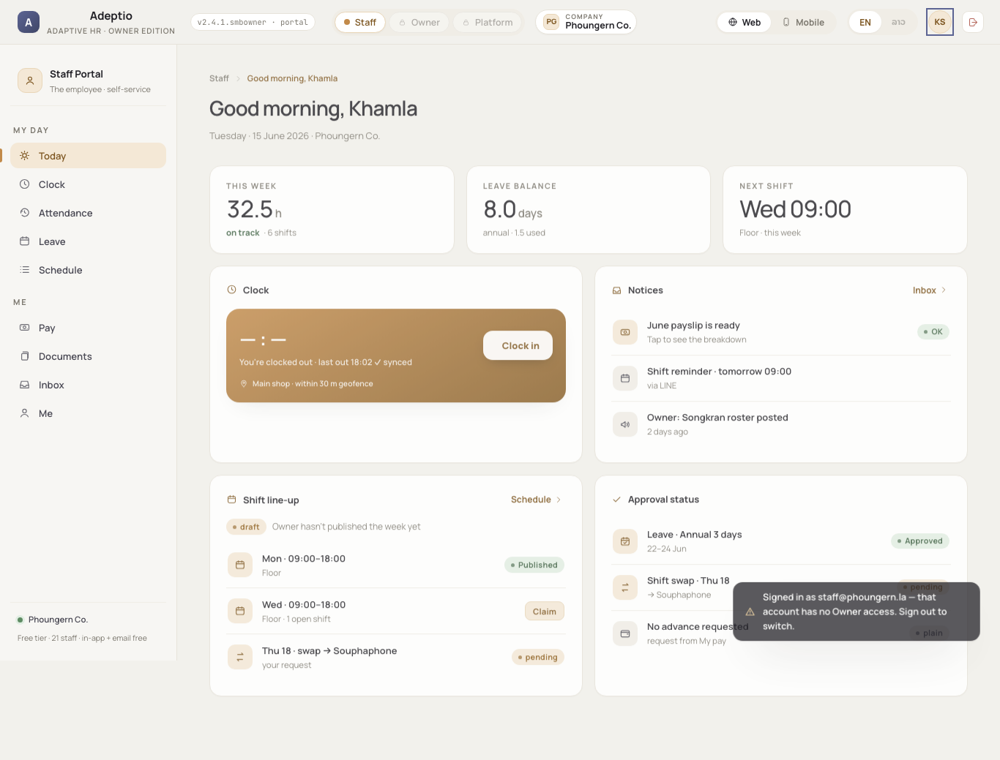
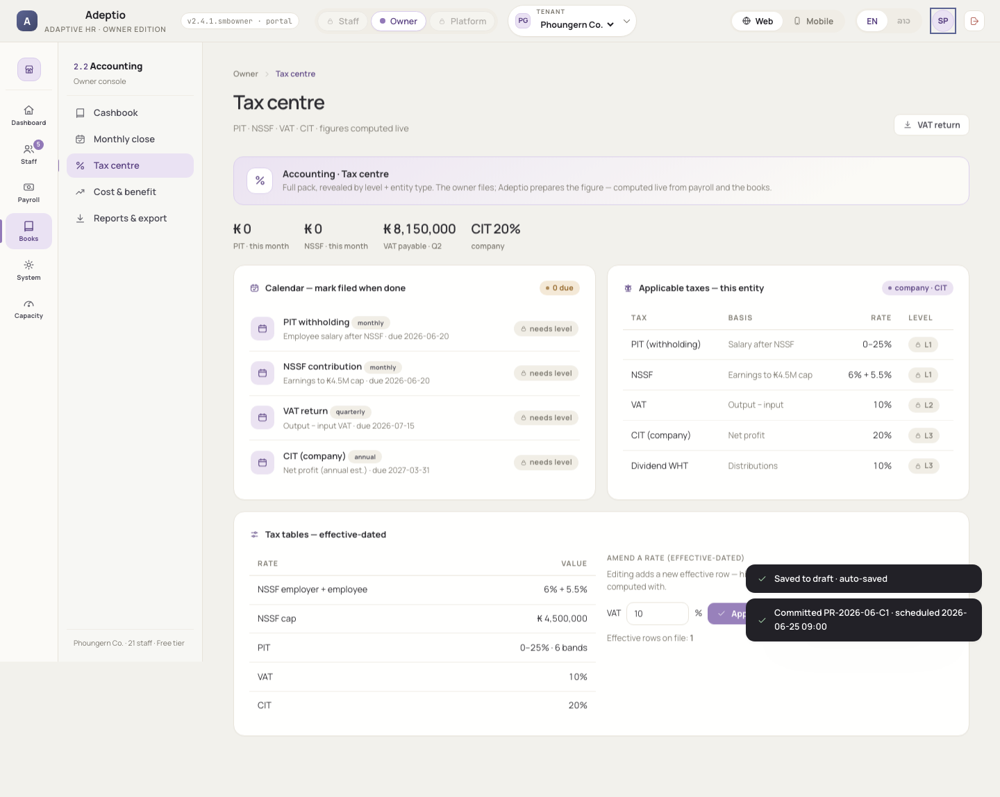
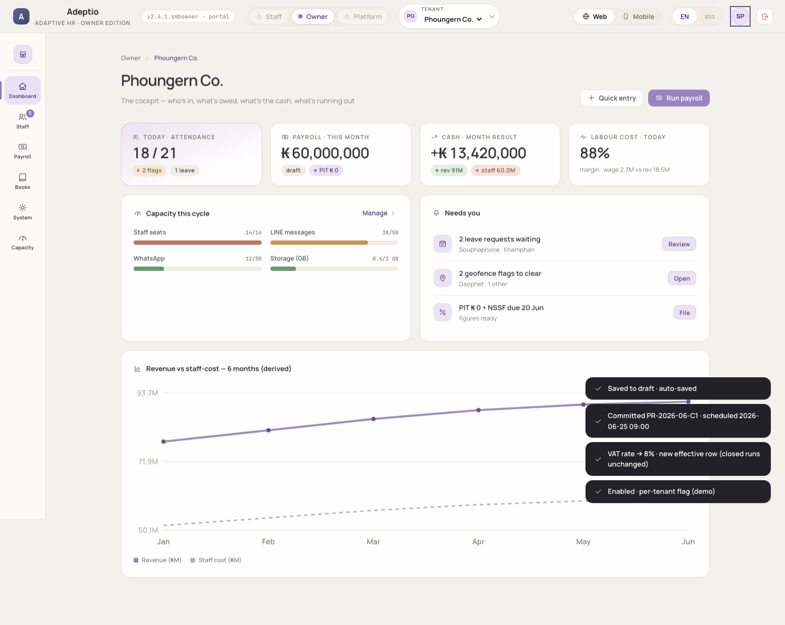
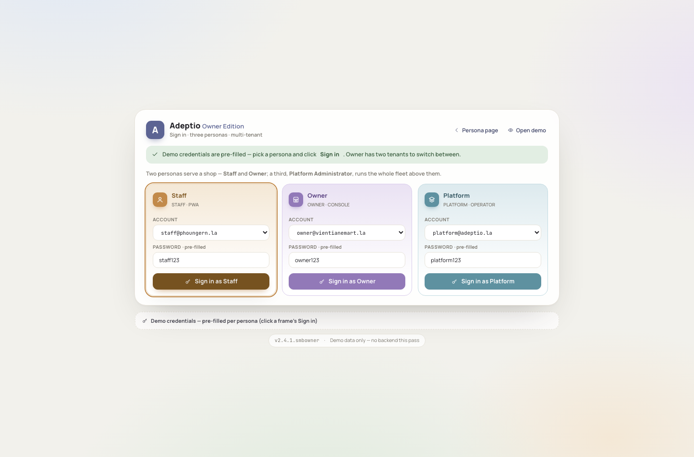
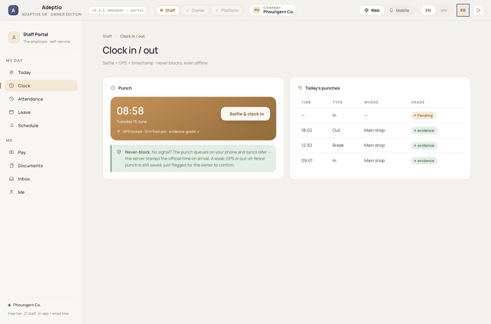

# Adeptio Owner Edition · v2.4.1.smbowner — E2E report

> ⚠️ **PRE-FIX SNAPSHOT (2026-06-16 06:33).** Superseded by the QA pass in
> `../../../v2.4.1.smbowner — Pre-Spin Recap (QA + Readiness) — 2026-06-16.md`.
> The 3 real HIGH findings below are now FIXED in `js/app.js` + `js/screens/staff.js`
> (flag-switch shadow · scope-guard URL · dead-end buttons); the other findings were
> harness artifacts (L0 tax leveling-gate · mobile title in `.ah-t`). Re-run this suite
> on a machine with Chromium to regenerate green.

_Playwright · real Chromium · generated 2026-06-16T06:33:22.486Z_

**Result:** ❌ 5 failing assertion(s) · 182 passed, 5 failed · 67 routes crawled · 3 persona flows.

## Findings by severity

| Severity | Count |
|---|---|
| 🟥 BLOCKER | 0 |
| 🟥 CRITICAL | 0 |
| 🟧 HIGH | 5 |
| 🟨 MEDIUM | 1 |
| 🟦 LOW | 0 |
| ⬜ INFO | 5 |

> Screenshots for every failure are in `tools/e2e/screenshots/`. Full machine-readable detail in `tools/e2e/results.json`.

## Findings (ordered by severity)

### 1. 🟧 [HIGH] auth — cross-persona access blocked (scope guard)

staff tried owner; ended at hash=#/owner/web/dashboard

### 2. 🟧 [HIGH] flow-owner — tax mark-filed persists to db_tax

filed=false

### 3. 🟧 [HIGH] flow-owner — feature flag toggle persists + reveals gated menu

ewa false→false, Advances in rail=false

### 4. 🟧 [HIGH] flow-staff — menu reachable: today

title=""

### 5. 🟧 [HIGH] flow-staff — staff primary flow "Clock in" is a dead-end

The "Selfie & clock in" punch button on /staff/web/clock has no data-act/data-go handler — clicking it does nothing, so a staff member cannot complete the core clock-in action. No db_time write occurs.

### 6. 🟨 [MEDIUM] dead-buttons — 33 inert controls across 19 screens

Buttons with no data-act/data-go/href that do nothing when clicked (demo-shell stubs). Examples — staff/today: "Claim" · staff/clock: "Selfie & clock in" · staff/attendance: "Request a fix" · staff/leave: "Request leave" · staff/schedule: "Claim", "Claim", "Claim", "Offer Thu 18 to a teammate" · staff/pay: "Payslip PDF" … (full list in results.json).

### 7. ⬜ [INFO] crawl — screen hidden by feature flag: /owner/web/advances

"advances" is gated off by default (FLAGS) — direct hash redirects to the persona landing. Expected behavior.

### 8. ⬜ [INFO] flow-staff — staff persona has no persisting create/edit/save in this build

All staff action buttons (Clock in, Request leave, Claim shift, Request a fix, Change password) are inert demo stubs; the only state-changing staff action (EWA request) is hidden unless the owner enables the EWA flag. Staff is effectively read-only this pass.

### 9. ⬜ [INFO] flow-platform — empty KYC queue handled without crash

Could not reproduce the empty(...) ReferenceError — verify manually.

### 10. ⬜ [INFO] persistence — all "DB stores" are in-memory only this pass (reset on reload)

Per the README, the live DB/Worker is a later pass. Every persistence assertion above verifies the in-session engine state (db_ledger, db_payroll, db_tax, db_workflow, db_registration …). A browser reload discards all saves — expected for this build, noted so "persisted" is read as in-session.

### 11. ⬜ [INFO] crawl — task brief said "4 personas + 3 sign-in portals"

App ships 3 persona shells (Staff · Owner · Platform) + a 4th delegated role (Manager) that rides the Owner shell with a subset, and 3 sign-in portal frames. So "4 personas / 3 portals" reconciles to 3 shells (3 portal frames) + Manager-on-Owner.

## Crawl matrix

Every route visited, per persona × device. ⚠ = wrong screen / token / error; · = clean; (hidden) = flag-gated.

**web**

- `staff`: today · clock · attendance · leave · schedule · pay · documents · inbox · me
- `owner`: dashboard · people · attendance · scheduling · leave · messaging · access · approvals · pay-runs · components · advances (hidden) · statutory · payslips · leveling · cashbook · close · tax · costbenefit · reports · company · functions · integrations · users · datastudio · audit · plan · seats · quotas · storage · billing
- `platform`: overview · registrations · tenants · resources · allocation · database · billing · security · pusers

**mobile**

- `staff`: today · clock · leave · pay · more · attendance · schedule · documents · inbox · me
- `owner`: home · staff · pay · books · more
- `platform`: overview · registrations · tenants · more

## Flow step results

**owner**

- ✅ cashbook add → db_ledger
- ✅ pay-run advance
- ✅ pay adj → draft
- ✅ pay commit → pendingPRs
- ❌ tax mark filed
- ✅ vat rate amend
- ❌ flag toggle (EWA→Advances)
- ✅ db backup
- ✅ approval decide
- ✅ scheduling publish
- ✅ tenant switch
- ✅ leveling switch

**staff**

- ❌ clock-in (primary) — dead-end: punch button inert

**platform**

- ✅ channel save
- ✅ KYC activate
- ✅ KYC reject
- ✅ platform db backup
- ✅ empty-queue crash test

## Inert controls (dead buttons) — appendix

Controls with no `data-act`/`data-go`/`href` (do nothing on click). Demo-shell stubs by design, but flagged per the brief.

- `staff/today` (1): "Claim"
- `staff/clock` (1): "Selfie & clock in"
- `staff/attendance` (1): "Request a fix"
- `staff/leave` (1): "Request leave"
- `staff/schedule` (4): "Claim", "Claim", "Claim", "Offer Thu 18 to a teammate"
- `staff/pay` (1): "Payslip PDF"
- `staff/documents` (1): "View"
- `staff/me` (1): "Change"
- `owner/people` (1): "Add person"
- `owner/attendance` (4): "Accept", "Ask fix", "Accept", "Ask fix"
- `owner/scheduling` (1): "New template"
- `owner/leave` (4): "Approve", "Decline", "Approve", "Decline"
- `owner/messaging` (1): "New broadcast"
- `owner/access` (4): "Manage", "Manage", "Manage", "Resend"
- `owner/integrations` (2): "Connect", "Connect"
- `owner/plan` (1): "See enterprise tiers"
- `owner/quotas` (1): "Top up"
- `platform/tenants` (2): "Suspend", "Suspend"
- `platform/allocation` (1): "Apply allocation"

---
_Re-run: `cd tools/e2e && node e2e.mjs`. Extends `tools/smoke.js` (node-VM structural test) with live-browser coverage._
